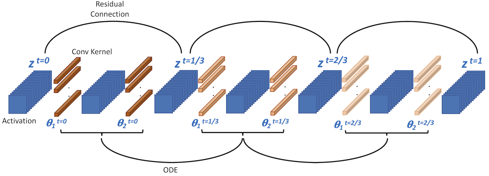

   


# ANODE: Adjoint Based Neural ODEs
ANODE is a neural ODE framework based on [this paper](https://arxiv.org/pdf/1902.10298.pdf).
It provides unconditionally accurate gradients for Neural ODEs, using adjoint method. It also
uses checkpointing to enable testing with large time steps without compromising accuracy in gradient computations.


# Examples
The main driver for ANODE is train.py file. It provdies command line options to test with different configurations.
An example use case to test with ResNet is:

```
python3 train.py --network resnet
```

Key command line options include:

- `network` Network structure to use. Currently we support ResNet and [SqueezeNext](https://github.com/amirgholami/SqueezeNext)
- `method` Specifies the discretization method to use for solving ODE. We currently support Euler, RK2, and RK4 methods
- `Nt` Number of time steps to use for solving ODE
- `lr` Value of leraning rate

